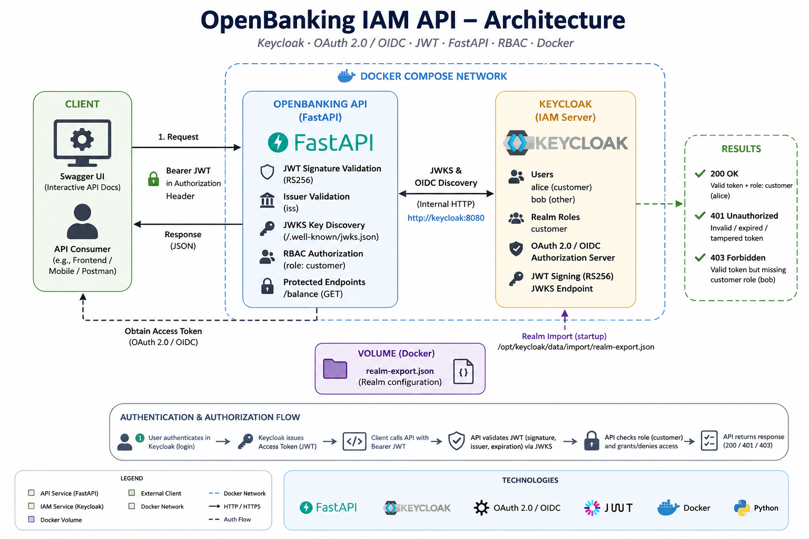

# OpenBanking IAM API

A containerized Open Banking API demonstrating authentication and authorization using **FastAPI, Keycloak, OAuth 2.0, OpenID Connect (OIDC), JSON Web Tokens (JWT), JWKS, and Role-Based Access Control (RBAC)**.

This project was originally developed as part of an **Access and Identity Management** academic project and was later reorganized into a reproducible Docker-based environment for cybersecurity and IAM portfolio purposes.

---

## Project Overview

The OpenBanking IAM API demonstrates how an application can delegate identity management to an external Identity and Access Management (IAM) platform.

Keycloak acts as the Identity Provider and Authorization Server, while FastAPI exposes a protected banking endpoint.

Users authenticate through Keycloak and receive an access token in JWT format. The API validates the token signature using Keycloak's JSON Web Key Set (JWKS), verifies the token issuer, and checks the user's assigned realm roles before granting access to protected resources.

The project demonstrates the distinction between:

- **Authentication** — verifying the identity represented by a valid JWT.
- **Authorization** — verifying that the authenticated identity has the required `customer` role.

---


## Architecture

The following diagram illustrates the authentication and authorization architecture of the OpenBanking IAM API:



The FastAPI container communicates with Keycloak through the internal Docker network using:

```text
http://keycloak:8080
```

The architecture separates the API from the Identity and Access Management service. Keycloak handles authentication and token issuance, while FastAPI validates JWTs and enforces authorization through the `customer` realm role.

---

## Security Features

- OAuth 2.0 authentication
- OpenID Connect (OIDC)
- JWT-based access tokens
- RS256 signature validation
- JSON Web Key Set (JWKS) key discovery
- Token issuer validation
- Role-Based Access Control (RBAC)
- Protected API endpoints
- Separation of authentication and authorization
- Environment-based configuration
- No credentials stored in the Git repository

---

## Technologies

- Python
- FastAPI
- Keycloak 26.2
- Docker
- Docker Compose
- OAuth 2.0
- OpenID Connect
- JSON Web Tokens (JWT)
- JSON Web Key Set (JWKS)
- PyJWT
- Uvicorn

---

## Project Structure

```text
openBanking-iam-api/
│
├── app/
│   ├── __init__.py
│   ├── auth.py
│   ├── config.py
│   ├── main.py
│   └── routes.py
│
├── keycloak/
│   └── realm-export.json
│
├── diagrams/
├── screenshots/
├── report/
│
├── .env.example
├── .gitignore
├── Dockerfile
├── docker-compose.yml
├── requirements.txt
└── README.md
```

---

## Keycloak Configuration

The repository includes a sanitized Keycloak realm configuration:

```text
keycloak/realm-export.json
```

Docker Compose automatically imports this configuration when Keycloak starts.

The imported environment includes:

- Realm: `OpenBanking`
- Client: `bank-api`
- Realm role: `customer`

Test users and passwords are intentionally **not stored in the repository**.

---

## Getting Started

### Prerequisites

Install:

- Docker
- Docker Compose
- Git

Verify Docker:

```bash
docker --version
docker compose version
```

---

### 1. Clone the Repository

```bash
git clone <repository-url>
cd OpenBanking-IAM-GitHub
```

---

### 2. Create the Environment File

Copy the example configuration:

```bash
cp .env.example .env
```

The example contains development credentials:

```env
KEYCLOAK_ADMIN=admin
KEYCLOAK_ADMIN_PASSWORD=change-me
```

Change the password in your local `.env` file before starting the environment.

The `.env` file is excluded from Git.

---

### 3. Start the Environment

Build and start Keycloak and FastAPI:

```bash
docker compose up -d --build
```

Check container status:

```bash
docker compose ps
```

Keycloak must become healthy before the API starts.

---

### 4. Verify Keycloak

Keycloak is available at:

```text
http://localhost:8080
```

The OpenID Connect discovery endpoint is:

```text
http://localhost:8080/realms/OpenBanking/.well-known/openid-configuration
```

The JWKS endpoint is:

```text
http://localhost:8080/realms/OpenBanking/protocol/openid-connect/certs
```

---

### 5. Verify the API

Health endpoint:

```bash
curl http://localhost:8000/health
```

Expected response:

```json
{
  "status": "running"
}
```

Swagger UI is available at:

```text
http://localhost:8000/docs
```

---

## Creating Test Users

Users are intentionally excluded from the exported realm so that passwords and credential data are not published in the repository.

Create two users from the Keycloak Admin Console in the `OpenBanking` realm.

### Alice — Authorized User

Create:

```text
Username: alice
```

Configure a non-temporary password and assign the realm role:

```text
customer
```

Alice represents an authenticated **and authorized** banking customer.

### Bob — Unauthorized User

Create:

```text
Username: bob
```

Configure a non-temporary password but **do not assign** the `customer` role.

Bob represents an authenticated user who does not have authorization to access the protected banking resource.

> Depending on the realm configuration and authentication flow, additional profile fields such as first name, last name, and email may need to be configured for test users.

---

## Authentication and Authorization Flow

```text
User
  |
  | Credentials
  v
Keycloak
  |
  | Access Token (JWT)
  v
Client
  |
  | Authorization: Bearer <token>
  v
FastAPI
  |
  +--> Retrieve Keycloak signing key through JWKS
  |
  +--> Validate JWT signature
  |
  +--> Validate issuer
  |
  +--> Read realm_access.roles
  |
  +--> Require "customer"
  |
  v
Protected /balance endpoint
```

---

## Protected Endpoint

| Method | Endpoint | Protection |
|---|---|---|
| GET | `/health` | Public |
| GET | `/balance` | Valid JWT + `customer` role |

The protected endpoint returns demonstration banking data:

```json
{
  "account": "123456789",
  "owner": "Alice Johnson",
  "balance": 2450.75,
  "currency": "CAD"
}
```

The banking information is fictional and used only for demonstration purposes.

---

## Security Testing

The project demonstrates three important authorization scenarios:

| Test | Expected Result |
|---|---|
| Valid Alice JWT with `customer` role | `200 OK` |
| Modified or invalid JWT | `401 Unauthorized` |
| Valid Bob JWT without `customer` role | `403 Forbidden` |

These tests demonstrate the difference between token validation and role-based authorization.

### 200 OK — Authorized

Alice possesses a valid JWT and the required `customer` role.

```text
Alice → Valid JWT → customer → /balance → 200 OK
```

### 401 Unauthorized — Invalid Token

A modified, malformed, expired, or otherwise invalid JWT fails token validation.

```text
Invalid JWT → JWT validation fails → 401 Unauthorized
```

### 403 Forbidden — Insufficient Permissions

Bob may possess a valid JWT but does not have the required `customer` role.

```text
Bob → Valid JWT → no customer role → /balance → 403 Forbidden
```

---

## JWT Validation

The API obtains Keycloak's OpenID Connect configuration and discovers the JWKS endpoint.

The JWT signature is validated using the public signing key provided by Keycloak.

The API also verifies that the token issuer corresponds to:

```text
http://keycloak:8080/realms/OpenBanking
```

Audience validation is currently disabled and is listed as a future security improvement.

---

## Docker Environment

Docker Compose runs two services:

```text
keycloak
openbanking-api
```

The API does not start until Keycloak passes its health check.

Keycloak automatically imports the sanitized `OpenBanking` realm configuration when the environment is created.

This makes the IAM infrastructure reproducible without requiring manual creation of the realm, client, and role.

---

## Screenshots

The `screenshots/` directory contains selected evidence from the implementation and security testing process, including examples of:

- Keycloak realm and role configuration
- JWT payload and role claims
- Successful authorized request (`200 OK`)
- Invalid JWT rejection (`401 Unauthorized`)
- RBAC denial (`403 Forbidden`)

---

## Future Improvements

Potential improvements include:

- JWT audience (`aud`) validation
- HTTPS/TLS deployment
- PostgreSQL for Keycloak persistence
- Secret management
- Refresh token handling
- Automated integration tests
- CI/CD pipeline
- Centralized logging and monitoring
- Fine-grained authorization policies
- Production-ready Keycloak deployment

---

## Disclaimer

This project is an educational cybersecurity and Identity and Access Management demonstration.

All banking information, accounts, users, and transactions represented by the API are fictional and intended solely for testing and educational purposes.

The Docker configuration uses Keycloak development mode and is **not intended for production deployment**.

---

## Author

**Carlos Mejia**

Cybersecurity / Identity and Access Management Portfolio Project
